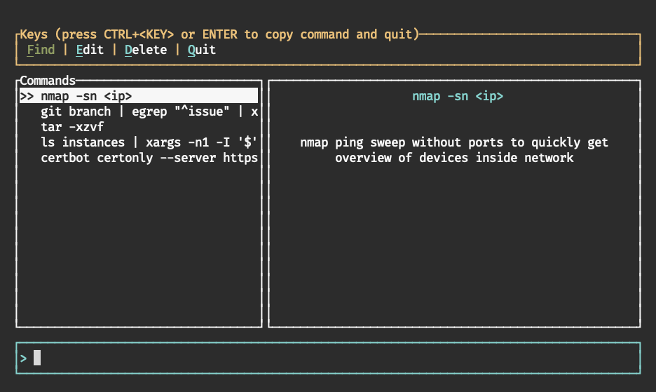

<div align="center">
  

  # crow - cli command memorizer

  [What is crow?](#what-is-crow) | [Usage](#usage) | [FAQ](#faq)


</div>

## What is crow?
**crow** (command row) is a CLI tool to help you memorize CLI commands by saving them with a unique description. Whenever you can't remember a certain command you can then use **crow** to fuzzy search commands by their description.

## Installation

To install crow make sure you have [homebrew](https://brew.sh/) installed and run:

```
brew tap sandstorm/crow
brew install crow
```

> Note: crow has currently only been tested on **Mac OSX** and we therefore only compile it for mac.
> However if you have the rust tool chain installed you can still either clone the repository and build from source
> or install the package from crates.io (the package is not yet published, but will be soon).
> Technically crow should run on most UNIX systems and maybe even on Windows.
> As soon as crow has been tested on more systems we may provide additional compiled binaries.

<div align="center">
  
</div>


## Usage

### Commands

* `crow` - default command, runs crow in fuzzy search mode
* `crow help` - shows help information
* `crow add <command>` - adds a provided command and prompts the user for a description
* `crow add:last` - adds the users last used command and prompts for a description (**note:** only `bash` and `zsh` are currently supported)


### Usage of the fuzzy mode

The fuzzy mode allows you to search, edit and delete your commands.
Your commands are saved to `~/.config/crow/crow_db.json` - so you could also manually edit that file.
When you press enter on command, **crow** will exit and copy the command into your clipboard so you can use it where you need it.

### mappings

| command    | description                           |
|------------|---------------------------------------|
| ↑          | Select previous command               |
| ↓          | Select next command                   |
| mousewheel | scroll description                    |
| ctrl+f     | find mode                             |
| ctrl+e     | edit mode to edit current command     |
| ctrl+d     | delete mode to delete current command |
| ctrl+q     | quit crow                             |


## FAQ

### Why the name

> There are multiple reasons for this:
> 1. I simply like crows
> 2. c-row -> command row -> command line -> that seemed fitting to me
> 3. Crows are very good at hiding things (e.g. peanuts), but also at finding them again.
>    **crow** does exactly that, it "hides" your commands and helps you finding them, whenever you need them ;)


### Isn't this just some glorified note taking tool?

> Yes. :) - Technically you could store anything inside crow and if you are very well organized and able to
> fuzzy search your notes anyway, you might not gain that much out of using **crow**.
> However I like to have focused tools and to be able to quickly access stuff from the command line, which
> is why I built crow.
